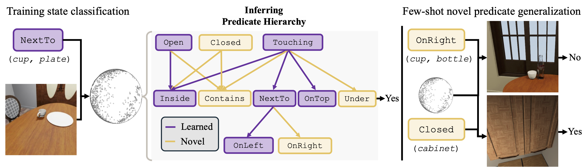

# Predicate Hierarchies Improve Few-Shot State Classification

Predicate Hierarchies Improve Few-Shot State Classification
[Emily Jin*](https://emilyzjin.github.io/), [Joy Hsu*](https://stanford.edu/~joycj/), [Jiajun Wu](https://jiajunwu.com/)

In International Conference on Learning Representations (ICLR) 2025

[[project page](https://emilyzjin.github.io/projects/phier.html)]

## Setup

## Evaluation

## Training
